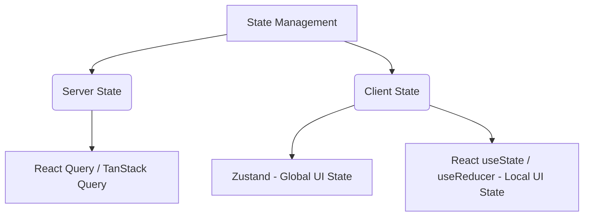

# Hướng Dẫn Phát Triển & Quy Tắc Làm Việc (CODING_RULES.md) 📐

Tài liệu này quy định các chuẩn mực lập trình, cấu trúc code, phong cách viết code và quy trình cộng tác dành cho tất cả lập trình viên tham gia dự án **ViTravel**.

---

## 1. 🏗️ Quy Tắc Kiến Trúc & Cấu Trúc Dự Án (Architecture & Folder Rules)

Dự án áp dụng mô hình lai giữa **Feature-Based (Theo Tính năng)** và **Layered (Theo Lớp kỹ thuật)**. Quy tắc tổ chức code như sau:

*   **Tính năng độc lập (Feature folder):** Toàn bộ UI components, types, schemas và helpers chỉ phục vụ riêng cho một tính năng (ví dụ: `tours`, `bookings`, `auth`, `payments`) PHẢI được đặt trong thư mục `src/features/[tên-tính-năng]/`.
    *   *Ví dụ:* `src/features/tours/components/TourCard.tsx`
*   **Thành phần dùng chung (Shared Components):**
    *   Các component cơ bản (Atoms/Molecules) dùng chung toàn app cấu hình theo Shadcn UI được đặt tại `src/components/ui/`.
    *   Các component bố cục dùng chung (như `Header`, `Footer`, `Loading`, `Pagination`) đặt tại `src/components/common/`.
*   **Next.js Pages & Layouts:** Thư mục `src/app/` chỉ chứa định tuyến, layout, middleware, API route và các tệp logic page kết nối đến các component ở `features` hoặc `components`. Hạn chế tối đa việc viết toàn bộ logic UI lớn trực tiếp trong `page.tsx` của `app/` — hãy bóc tách ra các components.
*   **Mock Data:** Thư mục `src/mocks/` chứa mock data độc lập. Khi Backend chưa sẵn sàng, lập trình viên sử dụng mock data này để dựng UI. Mock data phải tuân thủ đúng TypeScript interface được định nghĩa trong `src/types/`.

---

## 2. 🏷️ Quy Tắc Đặt Tên (Naming Conventions)

Sự đồng nhất trong cách đặt tên giúp code dễ đọc và dễ tìm kiếm. Tuân thủ nghiêm ngặt các quy tắc sau:

### 2.1. Đặt Tên File & Thư Mục
*   **Thư mục chứa nhóm/module:** Sử dụng `kebab-case` (ví dụ: `api-client`, `forgot-password`, `common`).
*   **File Component React:** Sử dụng `PascalCase` (ví dụ: `TourCard.tsx`, `Header.tsx`).
*   **File Hooks:** Sử dụng `camelCase` bắt đầu bằng tiền tố `use` (ví dụ: `useDebounce.ts`, `usePagination.ts`).
*   **File Constants/Types/Services/Stores:** Sử dụng `kebab-case` hoặc `camelCase` (ví dụ: `auth.store.ts`, `api-client.ts`, `booking.ts`).

### 2.2. Đặt Tên Trong Code
*   **Component & Class:** `PascalCase` (ví dụ: `export function TourGallery() {}`).
*   **Biến, Hàm & Object Instance:** `camelCase` (ví dụ: `const tourList = []`, `const fetchTourDetail = () => {}`).
*   **Hằng số (Constants) & Enums:** `UPPER_SNAKE_CASE` (ví dụ: `const API_URL = "..."`, `enum BookingStatus {}`).
*   **TypeScript Interfaces & Types:** `PascalCase` (ví dụ: `interface TourDetail {}`). Tránh đặt tiền tố `I` trước Interface (ví dụ: dùng `User` thay vì `IUser`).

---

## 3. 🗄️ Quản Lý Trạng Thái (State Management & Fetching)

Dự án phân định rõ ràng giữa **Server State** (Dữ liệu từ API) và **Client State** (Trạng thái UI cục bộ/toàn cục):



### 3.1. Server State (React Query & Axios)
*   Mọi hoạt động fetch, cache, và mutate dữ liệu từ API bên ngoài **bắt buộc** phải sử dụng **TanStack Query (@tanstack/react-query)**.
*   Không sử dụng `useEffect` để fetch dữ liệu từ API trên Client Side.
*   Đặt query key rõ ràng và có cấu trúc tốt (nên lưu trữ query keys tập trung hoặc dùng query key factory).

### 3.2. Client State (Zustand & Local State)
*   **Zustand:** Chỉ dùng để lưu trữ các trạng thái mang tính toàn cục thực sự của ứng dụng (ví dụ: thông tin xác thực của user đang đăng nhập, bộ lọc tìm kiếm toàn cục, cài đặt theme). Được đặt tại `src/store/`.
*   **React State (`useState`, `useReducer`):** Dùng cho các trạng thái giao diện nội bộ của một component (ví dụ: trạng thái đóng mở của Modal, giá trị nhập vào form trước khi submit, tab đang được active).

---

## 4. 📝 Biểu Mẫu & Xác Thực Dữ Liệu (Form & Validation)

*   **Thư viện chính:** Sử dụng **React Hook Form** kết hợp với **Zod Schema Resolver** để tối ưu hiệu năng render và kiểm tra tính hợp lệ của dữ liệu.
*   **Quy trình triển khai:**
    1.  Định nghĩa schema validate bằng Zod (ví dụ: `loginSchema`).
    2.  Dùng `z.infer<typeof loginSchema>` để trích xuất TypeScript type tự động cho form dữ liệu.
    3.  Khởi tạo hook `useForm` với resolver:
        ```typescript
        const { register, handleSubmit, formState: { errors } } = useForm<LoginInput>({
          resolver: zodResolver(loginSchema),
        });
        ```
*   **Thông báo lỗi:** Phải hiển thị lỗi rõ ràng ngay dưới mỗi ô nhập liệu không hợp lệ. Lỗi validate phải trực quan, dễ hiểu với người dùng.

---

## 5. 🎨 Quy Tắc Giao Diện & Styling (Tailwind CSS v4)

*   **Tailwind CSS v4:** Sử dụng các class tiện ích của Tailwind để viết CSS trực tiếp trên JSX. Tránh viết inline styles (`style={{ ... }}`) ngoại trừ các trường hợp giá trị thay đổi động liên tục (như vị trí chuột, phần trăm tiến trình animation).
*   **Ghép class động (Dynamic class merging):**
    *   Khi cần nối các class Tailwind dựa trên điều kiện, bắt buộc sử dụng helper `cn(...)` từ `@/lib/utils` (được xây dựng trên `clsx` và `tailwind-merge`) để tránh xung đột class CSS.
    *   *Ví dụ:* `className={cn("bg-blue-500", isActive && "bg-red-500", className)}`
*   **CVA (Class Variance Authority):** Đối với các component UI cơ bản có nhiều biến thể (như Button có variant: default, outline, destructive, size: sm, md, lg), sử dụng thư viện `cva` để quản lý các biến thể sạch sẽ và khoa học.

---

## 6. 🛡️ Quy Tắc Viết Code TypeScript (Clean Code & TypeScript Rules)

*   **Strict Mode:** Bắt buộc tuân thủ kiểm duyệt kiểu dữ liệu nghiêm ngặt.
*   **KHÔNG sử dụng kiểu `any`:** Hãy định nghĩa kiểu dữ liệu (type/interface) rõ ràng cho mọi biến, đối số đầu vào và kiểu trả về của hàm. Trong trường hợp bất khả kháng hoặc chưa rõ kiểu dữ liệu, sử dụng `unknown` thay vì `any`.
*   **Tránh dư thừa comment (Anti-patterns):** Không viết comment giải thích *code này làm gì* (nếu code đã tự giải thích được qua cách đặt tên biến và hàm). Chỉ viết comment giải thích *tại sao lại làm như thế này* (lý do nghiệp vụ hoặc giải thuật phức tạp).
*   **Tối giản logic Component:**
    *   Tách biệt logic xử lý (biến đổi dữ liệu, xử lý sự kiện phức tạp) khỏi phần render JSX.
    *   Một component không nên dài quá 250 dòng code. Nếu vượt quá, hãy xem xét tách nhỏ thành các sub-components hoặc viết custom hooks để tái sử dụng logic.

---

## 7. 📡 Tích Hợp API & Giả Lập Dữ Liệu (API & Mocking Rules)

*   **API Client:** Sử dụng instance Axios được cấu hình tại `src/lib/axios.ts` để gọi API. Instance này đã được thiết lập sẵn baseURL, interceptors để tự động đính kèm token xác thực và xử lý lỗi tập trung.
*   **Mocking:**
    *   Khi API backend chưa sẵn sàng, hãy tạo dữ liệu giả lập chất lượng cao trong `src/mocks/data/` (ví dụ: `tours.ts` chứa dữ liệu chi tiết các tour du lịch với đầy đủ các thuộc tính như thật).
    *   Tạo các hàm giả lập bất đồng bộ (trả về Promise kèm delay) trong `src/services/` để mô phỏng hành vi của API thực tế.
    *   Khi API thật hoàn thành, lập trình viên chỉ cần thay đổi hàm gọi trong `services` sang gọi endpoint thật mà không cần thay đổi logic render của UI.

---

## 8. 🌴 Quy Trình Làm Việc Với Git (Git Workflow & Commits)

Để tránh xung đột code và dễ dàng theo dõi lịch sử chỉnh sửa, toàn bộ thành viên dự án tuân theo quy tắc sau:

### 8.1. Quy Tắc Đặt Tên Nhánh (Branch Naming)
*   **`main` / `master` / `develop`:** Các nhánh chính, luôn chạy được ổn định. Không bao giờ commit trực tiếp lên các nhánh này.
*   **`feature/[tên-tính-năng]`:** Tạo tính năng mới (ví dụ: `feature/tour-detail-gallery`).
*   **`bugfix/[mô-tả-lỗi]`:** Sửa lỗi từ phản hồi thử nghiệm (ví dụ: `bugfix/login-token-refresh`).
*   **`hotfix/[mô-tả-lỗi-gấp]`:** Sửa lỗi nghiêm trọng trên môi trường production (ví dụ: `hotfix/payment-gateway-timeout`).
*   **`refactor/[nội-dung]`:** Cải tiến, tối ưu hóa code mà không làm thay đổi tính năng (ví dụ: `refactor/booking-form-logic`).

### 8.2. Quy Tắc Viết Commit Message (Conventional Commits)
Thông điệp commit phải ngắn gọn, súc tích và tuân theo định dạng: `<type>(<scope>): <subject>`

Các `<type>` được chấp nhận:
*   `feat`: Tính năng mới (new feature).
*   `fix`: Sửa lỗi (bug fix).
*   `docs`: Thay đổi tài liệu hướng dẫn (documentation).
*   `style`: Thay đổi định dạng code (khoảng trắng, format, thiếu dấu chấm phẩy - không ảnh hưởng logic).
*   `refactor`: Thay đổi code cải tiến cấu trúc (không sửa lỗi cũng không thêm tính năng).
*   `test`: Viết thêm unit test hoặc integration test.
*   `chore`: Cập nhật build tasks, cấu hình dev tools, package dependency (không ảnh hưởng source code).

*Ví dụ commit hợp lệ:*
*   `feat(tours): add search filter component`
*   `fix(auth): correct redirect path after password reset`
*   `docs(readme): update system prerequisites and pnpm setup instructions`
